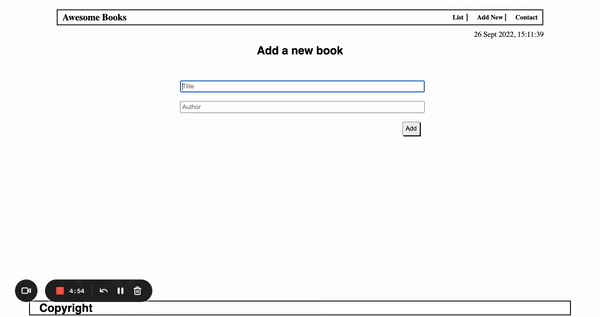

# Awesome Books

> "Awesome books" is a simple website that displays a list of books and allows you to add and remove books from that list.

## Built With (Linter)

- HTML (Webhint)
- CSS (Stylelint)
- JavaScript (Eslint)

## Project Preview

[Live Demo](https://ngozikanwocha.github.io/AwesomeBooks-ES6/)

## Authors

👤 **Ngozi Nwocha**

- GitHub: [@goddessngozi](https://github.com/GoddessNgozi)
- Twitter: [@goddessngozi](https://twitter.com/GoddessNgozi)
- LinkedIn: [@NgoziNwocha](https://www.linkedin.com/in/NgoziNwocha)

## 🤝 Contributing

Contributions, issues, and feature requests are welcome!

## Show your support

Give a ⭐️ if you like this project!

## 📝 License

This project is [Microverse](https://www.microverse.org/) licensed.